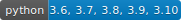

# silent-committer

Commits changes as original authors

## What is this for?
Doing a styling refactor? Applying a lint rule? Upgrading all calls of a function to a new signature?  
These tasks usually don't change the logic behind the code, and so we might want git blame to show the original author of the line before we made our cosmetic change.   
Git has an option to specify a different author for the entire commit (--author) but that will use a single author for our entire changes.

That's where *silent-committer* comes in -  
It analyses your uncommitted changes to find all the original authors, and then commits your changes in separate commits, each with a different author and only the code you changed of that author.

## Installation

```sh
pip install silent_committer
```

## Usage

```sh
cd <project_root>
silently-commit "<commit_msg>"
```

Example output of `git log` after running `silently-commit "Update usage of foo.bar()"`:
```git
commit 440b2aac9c9416c949c4727cd1e1ebba521e0b91 (HEAD -> master)
Author: John Doe <john.doe@example.com>
Date:   Tue Aug 9 12:51:43 2022 +0200

    Update usage of foo.bar(); For user: John Doe <john.doe@example.com>

commit 3e2ed2c0fda7c0419b13ebd80b9c68f28a007f1c
Author: Philip Jackson <pjackson@example.com>
Date:   Tue Aug 9 12:51:43 2022 +0200

    Update usage of foo.bar(); For user: Philip Jackson <pjackson@example.com>

commit 74ba0e526707f8aa0eb8c1fdca2938c1b2d44b9f
Author: Kate Cole <kate299@example.com>
Date:   Tue Aug 9 12:51:42 2022 +0200

    Update usage of foo.bar(); For user: Kate Cole <kate299@example.com>

commit 79d9fe1ee9176db71ccd3c96b3faa235ab055874
Author: William Calvert <williamcal@example.com>
Date:   Tue Aug 9 12:51:42 2022 +0200

    Update usage of foo.bar(); For user: William Calvert <williamcal@example.com>
```

## How does this work?

Silent committer does the following steps:

1. Unstages all changes.
2. Runs `git add -p` and splits all hunks that are splittable.
3. Parses the output of `git add -p` to get all hunks.
4. Stashes all changes (to be able to run `git blame`).
5. Finds the authors of all the changed lines using `git blame -w`.
6. Calculates the author of each hunk (if there is only one author for the changed lines in the hunk it uses that author,
otherwise it uses one of the authors of the changed lines that contibuted most to that hunk).
7. For each author - it stages all of its hunks and creates a commit using the `<commit_msg>` passed as arg and appends the author details.
For example if `<commit_msg>` is `pep8 formatting` then it will create a commit with the message `pep8 formatting; For user: John Doe <john.doe@example.com>`
for each author with the author being the original author while the committer still remains you.
8. All line additions (new and not modified lines) will be commited with you as the author.

*** **New files are not supported as this tool relies on unstaging all files, causing new files to become untracked and then it can’t know which of the untracked files you intend to commit, so please first commit all new files separately.**

## Disclaimer

In order to prevent code loss, it's best to first commit your changes and the run `git reset --soft HEAD^` so that you could return to your changes
using `git reflog` or alternitively stash your changes and run `git stash apply` to keep your changes in the stash if something goes wrong.
